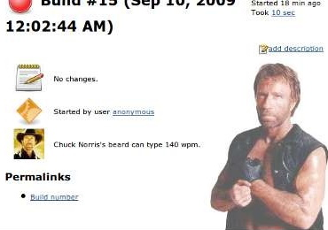
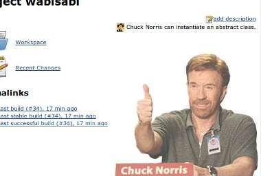
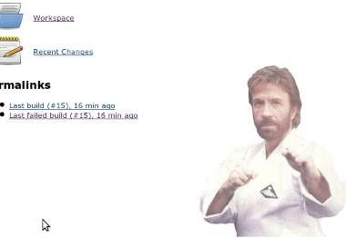

# Chuck Norris plugin for Jenkins

This plugin adds an absolutely delightful feature to Jenkins:
depending if your build succeeds, fails, or is unstable,
it will show a picture of Chuck Norris *auto-adapting* (that's right, computer science it is!) to the build result!

Seeing that, already many thousands (yes, *thousands*!) of people have decided to take the plunge and install this plugin to finally see the light.
Why not you?

## Download & Installation

You can preferably install this plugin directly from the Plugins Update Center,
or if need be by downloading the [latest .hpi](http://updates.jenkins-ci.org/latest/chucknorris.hpi) and install it from the _Manage Plugins_ menu.

## Usage

1.  After installing the plugin, go to job configuration page, a checkbox with the text _Activate Chuck Norris_ should appear.
2.  Tick the checkbox and save the configuration.
    For a freestyle job, Chuck Norris image (along with a random quote) will appear on the job page.
3.  Run a build. After it's completed, Chuck Norris image (and the random quote) should also appear on the build page.
    This is applicable for both Freestyle, Maven and Jenkins Pipeline jobs.

### Screenshots

## Release Notes

See [GitHub Releases](https://github.com/jenkinsci/chucknorris-plugin/releases).

## Testimonials

-   Uncle Bob Martin said ChuckNorris Plugin [is *very* motivating](http://twitter.com/unclebobmartin/statuses/10741488856).

## Credits

* [Chuck Norris 'The Programmer' facts](http://www.codesqueeze.com/the-ultimate-top-25-chuck-norris-the-programmer-jokes)
* [Emotional Jenkins Plugin](https://plugins.jenkins.io/emotional-jenkins-plugin/).
