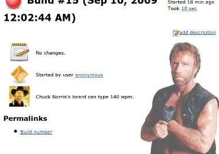
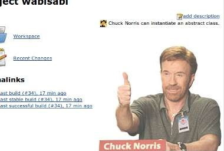
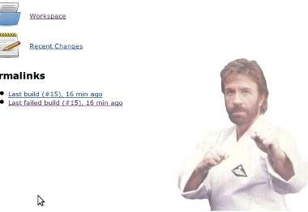

# Chuck Norris plugin for Jenkins

[](https://plugins.jenkins.io/chucknorris)
[](https://github.com/jenkinsci/chucknorris-plugin/releases/latest)
[](https://plugins.jenkins.io/chucknorris)

This plugin adds an absolutely delightful feature to Jenkins:
depending if your build succeeds, fails, or is unstable,
it will show a picture of Chuck Norris *auto-adapting* (that's right, computer science it is!) to the build result!

Seeing that, already many thousands (yes, *thousands*!) of people have decided to take the plunge and install this plugin to finally see the light.
Why not you?

## Download & Installation

Install this plugin from the Jenkins Plugin Manager (_Manage Jenkins > Plugins > Available plugins_),
or download the [latest .hpi](https://updates.jenkins.io/latest/chucknorris.hpi) and upload it via _Manage Jenkins > Plugins > Advanced settings_.

## Usage

### Freestyle / Maven jobs

1.  Open the job’s configuration page, click **Add post-build action**, and select **Activate Chuck Norris**.
2.  Save the configuration.
3.  Run a build. After it completes, Chuck Norris (along with a random quote) will appear on the job and build pages.

### Pipeline jobs

Add the `chuckNorris()` step to your Jenkinsfile:

```groovy
pipeline {
    agent any
    stages {
        stage(‘Build’) {
            steps {
                echo ‘Building...’
            }
        }
    }
    post {
        always {
            chuckNorris()
        }
    }
}
```

### Screenshots





## Release Notes

See [GitHub Releases](https://github.com/jenkinsci/chucknorris-plugin/releases).

## Testimonials

-   Uncle Bob Martin said ChuckNorris Plugin [is *very* motivating](https://x.com/unclebobmartin/status/10741488856).

## Localization

Facts are displayed in the user's browser locale when available. Supported languages:

- English (default)
- German
- Italian
- Slovak

Contributions of new translations are welcome — see the `FactGenerator.properties` files under `src/main/resources`.

## Credits

* [Chuck Norris 'The Programmer' facts](https://web.archive.org/web/2020/http://www.codesqueeze.com/the-ultimate-top-25-chuck-norris-the-programmer-jokes)
* [Emotional Jenkins Plugin](https://plugins.jenkins.io/emotional-jenkins-plugin/).
